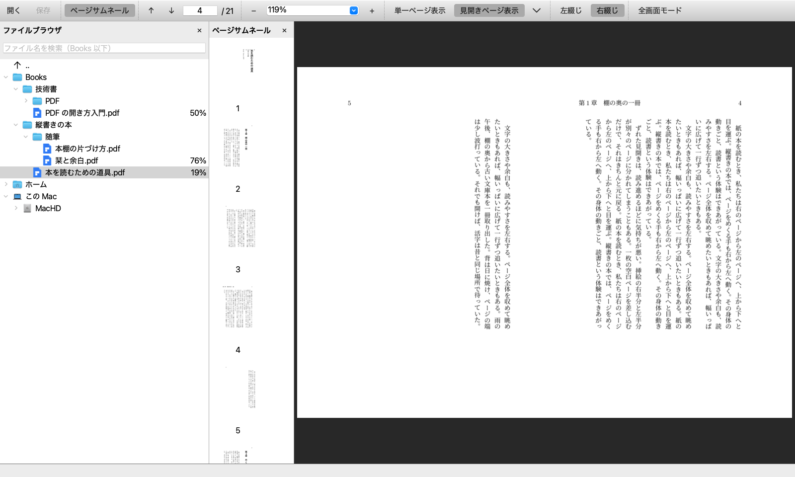
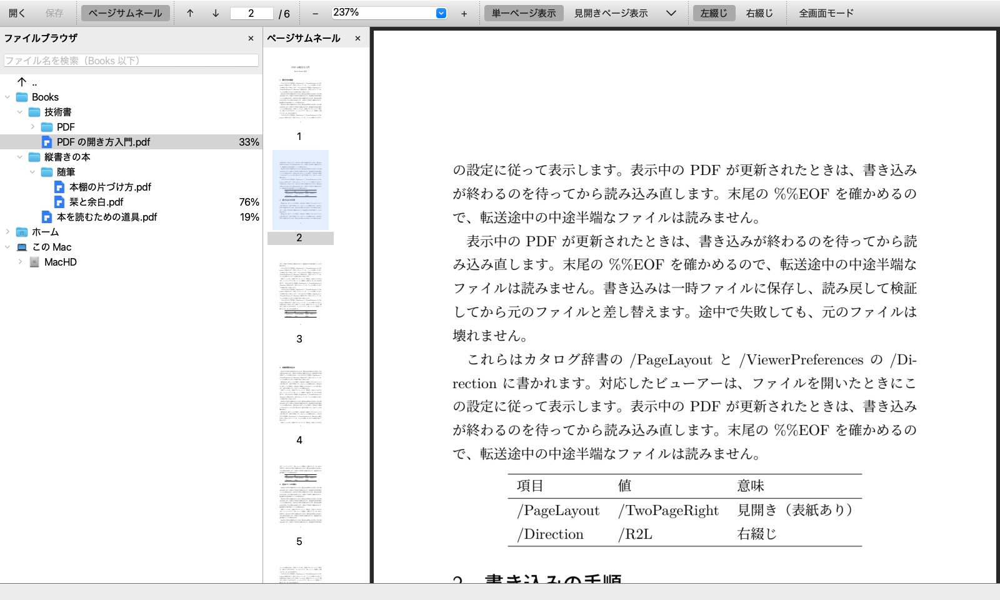
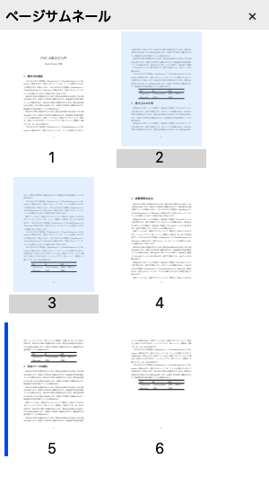
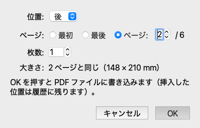
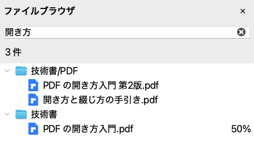

# Book Viewer

**自炊本の PDF を、紙の本と同じ感覚で読むためのビューア。**
見開き・右綴じ・表紙の有無をその場で切り替えて見比べ、気に入った「開き方」を **PDF ファイルそのものに保存** できます。

[](https://github.com/mashi727/book-viewer/releases/latest)




<sub>縦書きの本を右綴じ・見開き（表紙あり）で表示したところ。左からフォルダツリー、ページサムネール、ページ。
画面の本は説明用に自作したサンプル（[`docs/sample/`](docs/sample/)）。</sub>

## 特徴

- **開き方を試して、そのまま PDF に保存** — 単一ページ / 見開き（表紙あり・なし）/ 左綴じ・右綴じをボタンで切り替え、
  ［保存］で PDF 標準の設定として書き込みます。Acrobat など、この設定に対応したビューアーでも同じ開き方で開きます。
- **縦書きの本は右から左へ** — 右綴じの本は ← キー・左半分のクリック・右へのスワイプで次のページへ。
  OCR の文字が入った PDF なら、縦書きかどうかを自動で判定します。
- **ずれた見開きを空白ページで直す** — 白紙の飛ばしやスキャン漏れで左右がずれた本に、
  隣のページと同じ大きさ・向きの空白ページを差し込めます。
- **サムネールをドラッグしてページを並べ替え** — ⇧ / ⌘ で複数選択し、サムネールの間へドラッグ。
  挿入や並べ替えは Acrobat と同じく未保存の変更になり、［保存］でまとめて PDF に書き込みます。
- **本棚をファイル名で検索** — 起動フォルダ以下（サブフォルダも含む）の PDF を、打つそばから絞り込みます。
  全角・半角や大文字・小文字の違い、macOS のファイル名に多い濁点の分解形も吸収します。
- **読んでいたページから再開** — 本ごとに位置を覚え、フォルダツリーには読書の進捗（%）を表示します。
- **PDF の更新を自動で読み込み直す** — TeX で組み直したときなど、書き込みが終わるのを待って、同じページのまま最新版を表示します。
- **Acrobat と同じ操作** — メニュー・ショートカット（⌘D 文書のプロパティ、⌘L 全画面、⌘0/⌘1/⌘2 ズームなど）と用語を Acrobat に合わせています。
  フォルダツリーだけは Windows エクスプローラー風です。

## ダウンロード

[**最新のリリース**](https://github.com/mashi727/book-viewer/releases/latest) から入手できます。

| OS | ファイル | 起動 |
|---|---|---|
| Windows (x64) | `book-viewer-<版>-windows-x64.exe` | そのまま実行（exe 1 つ。起動に数秒かかります） |
| macOS (Apple シリコン) | `book-viewer-<版>-macos-arm64.zip` | 展開した `Book Viewer.app` を開く |

署名していないため、初回は OS に止められます。

- **Windows**: 「Windows によって PC が保護されました」→「詳細情報」→「実行」
- **macOS**: 「開発元を検証できません」→ Finder で右クリック →「開く」
  （または `xattr -dr com.apple.quarantine "Book Viewer.app"`）

## 画面

### 拡大・縮小



ページレベル（⌘0）・実際のサイズ（⌘1）・幅に合わせる（⌘2）・ズームイン / アウト（⌘+ / ⌘−）。
はみ出したときはスクロールし、ページの端でさらに送ると次のページへ進みます（Acrobat の単一ページ表示と同じ）。

### 開き方をボタンで切り替えて保存


いまの表示が PDF に保存された開き方と違うとき、または未保存のページの編集（挿入・移動）があるときだけ
**［保存 •］** になり、押すとまとめて PDF に書き込みます。「見開きページ表示」の隣の ⌄ で表紙あり / なしを選べます。

### ページの編集 — 並べ替えと空白ページ

<table>
<tr>
<td width="46%"></td>
<td></td>
</tr>
<tr>
<td>サムネールを ⇧ / ⌘ で複数選択し、間へドラッグして並べ替え（青い線が落とす位置）</td>
<td>空白ページを挿入（⇧⌘T・サムネールの右クリック）。基準ページと同じ大きさ（mm で表示）・向きで作る</td>
</tr>
</table>

どちらも Acrobat と同じく **未保存の変更** になり、元の PDF には［保存］（⌘S）するまで手を付けません。
保存しないまま別の本を開く・閉じるときは「保存しますか？」と確認します。

### 本棚をファイル名で検索



起動フォルダ以下（サブフォルダも含む）の PDF を、打つそばから絞り込みます（⇧⌘F）。空白で区切るとすべての語を含むものに、
全角 / 半角・大文字 / 小文字の違いは区別しません。結果はフォルダごとにまとめて表示し、1 件なら Enter で開きます。

## 使い方

### メニューとショートカット

| メニュー | 項目 | キー |
|---|---|---|
| ファイル | 開く…（PDF） / フォルダを開く… | ⌘O / ⇧⌘O |
| | 保存（ページの挿入・移動と、いまの表示のページレイアウト・綴じ方を PDF に書き込む） | ⌘S |
| | 閉じる | ⌘W |
| | 文書のプロパティ…（開き方・綴じ方） | ⌘D |
| 編集 | ファイル名を検索…（起動フォルダ以下、サブフォルダも含む） | ⇧⌘F |
| 文書 | 空白ページを挿入… | ⇧⌘T |
| （サムネール） | ページの移動: ⇧ / ⌘ + クリックで複数選択し、サムネールの間へドラッグ | |
| 表示 › ページナビゲーション | 最初 / 前 / 次 / 最後のページ、ページへ移動… | ⇧⌘N（ページへ移動） |
| 表示 › ページ表示 | 単一ページ表示 / 見開きページ表示 / 見開きページ表示で表紙を表示 / 左綴じ / 右綴じ | |
| 表示 › ズーム | ズームイン / ズームアウト、ページレベル / 実際のサイズ / 幅に合わせる | ⌘+ / ⌘−、⌘0 / ⌘1 / ⌘2 |
| 表示 › 表示切り替え | ナビゲーションパネル › ページサムネール、フォルダツリー | F4（サムネール） |
| 表示 | 全画面モード | ⌘L（Esc で解除） |

Windows では ⌘ の代わりに Ctrl を使います。

### ページ送り

| 操作 | 動作 |
|---|---|
| → / ← | 綴じ方向に沿って次 / 前（右綴じでは ← が「次」） |
| Space・↓ / ⇧Space・↑ | 次 / 前（拡大時はページ内をスクロールし、端で次 / 前へ） |
| PageDown / PageUp | 次 / 前の組 |
| Home / End | 先頭 / 末尾 |
| ホイール・トラックパッド | 縦スクロールは下で次。横スワイプは綴じ方向に沿う |
| クリック / ドラッグ | 左半分 = ←、右半分 = → / 拡大時は表示位置を動かす |

### フォルダツリー

```
  ↑ ..              ← 起動フォルダを 1 つ上へ
▸ 📁 <起動フォルダ>
▸ 🏠 ホーム
▾ 💻 この Mac（Windows では PC）
    ▸ 起動ディスク / 外付けドライブ / ネットワークドライブ
```

- PDF とフォルダだけを表示（隠しファイルは Finder / エクスプローラーと同じく非表示）。並びは自然順（「2巻」→「10巻」）
- PDF をクリックで開き、前回の位置から再開。右端は読書の進捗、マウスを乗せると表紙のサムネイル
- フォルダ内の追加・削除やドライブの抜き差しは自動で反映
- 上の検索欄（⇧⌘F）で、起動フォルダ以下の PDF をファイル名で探せる。空白で区切るとすべての語を含むものに絞り込み、
  結果はフォルダごとにまとめて表示。1 件なら Enter で開く。✕ か Esc でツリーに戻る

<details>
<summary><b>PDF に書き込む内容</b></summary>

PDF 標準（ISO 32000）の項目だけを書き換えます。

| 設定 | 書き込む値 |
|---|---|
| 単一ページ | `/PageLayout /SinglePage` |
| 見開き（表紙あり） | `/PageLayout /TwoPageRight` |
| 見開き（表紙なし） | `/PageLayout /TwoPageLeft` |
| 右綴じ / 左綴じ | `/ViewerPreferences << /Direction /R2L >>` / `/L2R` |
| 空白ページの挿入 | 基準ページの MediaBox・CropBox・Rotate・UserUnit を写した空のページを追加 |
| ページの移動 | ページ木の並びを入れ替える（ページの中身・しおりの参照はそのまま） |

- 同じフォルダの一時ファイルに保存 → 読み戻して検証（全ページの中身が意図した順に並んでいるか）→ 元のファイルと差し替え、の順で書き込むので、途中で失敗しても元のファイルは壊れません
  （Windows では、開いているファイルを置き換えられない場合に検証済みの内容を上書きコピーします）
- 変更前の値や挿入した位置は、書き込み履歴（`prefs-log.jsonl`）に残ります
- 他のビューアーがこれらの設定をどこまで尊重するかは、ビューアーによって違います

TeX で作る PDF は、組み直すたびに書き込んだ設定が消えます。ソース側で指定してください。

```latex
\usepackage[pdfpagelayout=TwoPageRight, pdfdirection=R2L]{hyperref}
```

</details>

<details>
<summary><b>縦書きの判定と、PDF の自動再読込の仕組み</b></summary>

**綴じ方の決め方**

1. PDF に書かれた綴じ方（［保存］や ⌘D で保存したもの）
2. 書かれていなければ、テキストレイヤー（OCR など）の文字の並びで判定し、縦書きなら右綴じで表示
3. 画像だけの本は判定しない（左綴じ）。縦書きなら［右綴じ］→［保存］で一度設定すれば、次からその向きで開く

画像から行の向きを推定する方法も試しましたが、手元の自炊本 950 冊でページごとに判定が割れました。
誤判定すると矢印キーの向きが逆になるため採用していません。

**自動再読込**

表示中の PDF が変更されると、サイズと更新時刻が 400 ms 変わらず、かつ末尾に `%%EOF` があるのを確かめてから読み直します
（最大約 20 秒再試行）。`scp` のように既存ファイルを先頭から上書きする転送では、転送が止まった瞬間の書きかけを
読まないためにこの条件が要ります（PDF の描画ライブラリは壊れた PDF も開けてしまい、ページ数の少ない版を読むことになる）。

</details>

<details>
<summary><b>設定と状態の保存場所</b></summary>

| 内容 | macOS / Linux | Windows |
|---|---|---|
| 読書位置・前回のフォルダ・パネルの表示・ズーム | `~/.local/state/book-viewer/state.json` | `%LOCALAPPDATA%\book-viewer\state.json` |
| PDF への書き込み履歴 | `~/.local/state/book-viewer/prefs-log.jsonl` | `%LOCALAPPDATA%\book-viewer\prefs-log.jsonl` |
| サムネイル（消しても再生成） | `~/.cache/book-viewer/thumbs/` | `%LOCALAPPDATA%\book-viewer\cache\thumbs\` |
| 未保存のページ編集の作業用コピー（保存・破棄で消える。残っても 1 日で掃除） | `~/.cache/book-viewer/work/` | `%LOCALAPPDATA%\book-viewer\cache\work\` |

読書位置は PDF の絶対パスで覚えるので、ファイル名を変えると引き継がれません。

</details>

## ソースから使う（uv）

```bash
git clone https://github.com/mashi727/book-viewer.git
cd book-viewer
uv tool install --editable .     # book-viewer コマンドを導入
book-viewer <フォルダ>            # 本棚として開く
book-viewer <本.pdf>              # その本を開く
book-viewer                       # 前回のフォルダを開く
```

開発:

```bash
uv run book-viewer <フォルダ>
uv run pytest                                      # テスト
uv run --group build python packaging/build.py     # 配布用バイナリ（その OS の上で作る）
```

タグ `v*` を push すると、GitHub Actions が Windows と macOS のバイナリを作り、画面なしで起動する自己診断
（PDF を開く・描く・開き方を書き込む・空白ページの挿入とページの移動を保存する）を通してから Release に添付します。
変更の一覧は [CHANGELOG.md](CHANGELOG.md) にあります。

PySide6（Qt / QtPdf）と pikepdf で作っています。

## ライセンス

[MIT License](LICENSE)
